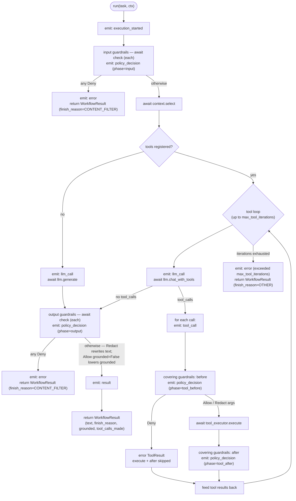

# Architecture

## Why a port/adapter layer

`odwi-llm` is built entirely out of thin **ports** (interfaces) with
interchangeable **adapters** behind them. A port names a small contract —
"talk to an LLM", "select context", "run a guardrail" — and nothing in
the application depends on more than that. The payoff is threefold:
**provider libraries are swappable** (LiteLLM, Any-LLM or a native SDK sit
behind `LLMPort`; changing one touches no application code); **tests run
with no network** (every port has an in-memory fake, and the LLM contract
also replays recorded cassettes, so the whole suite is offline and
deterministic); and **there is no vendor lock-in** — the moment a
provider, a model, or an orchestration engine stops fitting, it is
replaced at its adapter, not unpicked from the codebase.

## Two stages

The package grew in two stages that stack rather than blend.

**Stage 1 — LLM access** (`core/` + `adapters/`). `core/` is the LLM
contract: the `LLMPort` interface, the request/response types, an error
hierarchy the domain sees instead of raw library exceptions, a
synchronous facade (`SyncLLM`) and a fallback combinator (`FallbackLLM`).
`adapters/` is the only place a provider library may be imported;
`LiteLLMAdapter` and `AnyLLMAdapter` translate that contract to and from a
real provider. An application that only needs to call a model stops here.

**Stage 2 — the AI Core** (`guardrails/`, `observability/`, `context/`,
`orchestration/`). This layer governs *how* a model is used: which inputs
are in scope, which context grounds an answer, which tools may run and
with what arguments, which outputs are acceptable, and what is recorded.
Like Stage 1 it is ports and types only — the actual rules are
domain-specific and belong to each consuming application, never to this
library.

`Composer` is the seam. An application builds its `LLMPort` (Stage 1), its
guardrails, its context source, its tool executor and its observability
sink, hands them all to `Composer`, and gets back an assembled
`Orchestrator` — by default a `Workflow` that walks the lifecycle below. A
Stage 2 application is therefore a Stage 1 application plus a set of
policies wired in one place.

## `Workflow.run()` lifecycle

`Workflow` is the reference `Orchestrator`. One call to `run(task, ctx)`
walks input policy → context → the model → an optional tool loop → output
policy, and emits an observability event at every marked point (all
events go through `ObservabilityPort.emit`; the default sink is a no-op).



Notes the diagram compresses:

- **Input and output `Deny` end the run; a tool `before` `Deny` does
  not.** The orchestrator is mechanism, not policy — a single failed tool
  call among possibly several in one turn is fed back to the model as an
  error `ToolResult` to react to, not treated as grounds to abort.
- The `llm_call` event fires **once per turn** — once in the no-tools
  path, once per iteration of the tool loop.
- `policy_decision` appears **at least twice** (input, output), plus one
  `tool_before` per covering guardrail evaluated on a tool call, plus one
  `tool_after` per covering guardrail — but `tool_after` fires only when
  no `before` denied that call: a `before` `Deny` returns the error
  result immediately, with no `execute` and no `after`.
- Hitting `max_tool_iterations` returns a `WorkflowResult`
  (`finish_reason=OTHER`, text `"stopped: exceeded max_tool_iterations
  (N)"`), never an exception.

## `Decision[T]` — the shared vocabulary

Every guardrail, in every phase, answers with the same three-way type
instead of a bare boolean:

- **`Allow`** — let it through. Carries `grounded: bool` (default `True`):
  `False` means "allowed, but this is general knowledge with no specific
  datum behind it", so an output layer or the UI can mark the answer
  differently. `grounded=False` from any output guardrail lowers
  `WorkflowResult.grounded`.
- **`Deny`** — block it, with a `reason`. In the input and output phases a
  `Deny` ends the run (`WorkflowResult` with
  `finish_reason=CONTENT_FILTER`). In a tool `before` it blocks that one
  call, not the run.
- **`Redact[T]`** — allow a modified version. `Redact` is generic because
  the thing being replaced is not always text.

The application points:

| Phase | Protocol method | Decision type | Effect of `Redact` |
|---|---|---|---|
| input | `InputGuardrail.check(message, ctx)` | `Decision[str]` | type allows it; the reference `Workflow` passes the message through unchanged |
| tool args | `ToolGuardrail.before(call, ctx)` | `Decision[dict[str, Any]]` | the tool runs with the sanitized arguments |
| tool result | `ToolGuardrail.after(call, result, ctx)` | `Decision[str]` | the tool result content is replaced |
| output | `OutputGuardrail.check(response, ctx)` | `Decision[str]` | the response text is rewritten |

Because it is a discriminated union (`Allow | Deny | Redact[T]`, each with
its own `kind` literal), a `match` over a `Decision` is exhaustively
checked by the type checker — adding a variant later cannot be silently
mishandled by existing dispatch code.

## Five extension points

Everything an application supplies is one of five ports.

| Port | Contract | What a real app puts here |
|---|---|---|
| `LLMPort` (`core/port.py`) | `generate` · `structured` · `stream` · `chat_with_tools` + `capabilities` | usually a provided adapter (`LiteLLMAdapter` / `AnyLLMAdapter`), optionally wrapped in `FallbackLLM`; or its own adapter over another library — `adapters/litellm_adapter.py` is the formal reference for that; [`11_ai_core_max_iterations.py`](examples/11_ai_core_max_iterations.py) shows the same structural move (implementing the `ABC` directly) at its smallest: a fake scripted for one property, not a complete adapter |
| `InputGuardrail` / `ToolGuardrail` / `OutputGuardrail` (`guardrails/port.py`) | `async check` / `before` + `after` → `Decision`; `ToolGuardrail.covers` names the tools it governs (`None` = all) | the real policy: topic scope, data-access rules, injection detection, argument validation, output schema and style checks |
| `ContextPort` (`context/port.py`) | `async select(*, message=None, ctx)` → `ContextBundle` | retrieval: history, RAG, aggregated run data. The data-access filter runs here — inside `select`, using `ctx.scope`, before the bundle is built |
| `ObservabilityPort` (`observability/port.py`) | `emit(event, **fields)` | a bridge to OpenTelemetry / Langfuse / structured logging. Default is `NullObservability` (no-op) |
| `Orchestrator` (`orchestration/port.py`) + `ToolExecutor` | `async run(task, ctx)` → `WorkflowResult`; `async execute(call, ctx)` → `ToolResult` | usually nothing for `Orchestrator` — `Workflow` is the default. A `ToolExecutor` that actually runs the app's tools; later, an adapter over an agentic engine |

**Stage 1** usage is shown end to end in
[`examples/`](examples/README.md) — [`01_basic_generate.py`](examples/01_basic_generate.py),
[`02_sync_script.py`](examples/02_sync_script.py),
[`03_structured_output.py`](examples/03_structured_output.py),
[`04_fallback.py`](examples/04_fallback.py).

**Stage 2** is shown in
[`05_ai_core_minimal.py`](examples/05_ai_core_minimal.py) (the smallest
`Composer` path, lifecycle printed),
[`06_ai_core_guardrails.py`](examples/06_ai_core_guardrails.py) (`Deny`
and `Redact` in action) and
[`07_ai_core_tools.py`](examples/07_ai_core_tools.py) (the tool-calling
loop). In outline:

```python
from odwi_llm.guardrails.port import GuardrailSet
from odwi_llm.guardrails.types import PolicyContext
from odwi_llm.orchestration.composition import Composer
from odwi_llm.orchestration.types import WorkflowTask

comp = Composer(
    llm=llm,                       # any LLMPort from Stage 1
    context=my_context,            # a ContextPort
    guardrails=GuardrailSet(       # the app's real guardrails
        input_guardrails=[...],
        tool_guardrails=[...],
        output_guardrails=[...],
    ),
    tools=[...], tool_executor=my_executor,   # optional
    observability=my_obs,                     # optional, default no-op
)
ctx = PolicyContext(
    session_id="s1", provider="groq", model="…", resolved_at=now
)
result = await comp.orchestrator.run(
    WorkflowTask(session_id="s1", input={"message": "…"}), ctx
)
```

## Same shape, different domains

`Composer` and `GuardrailSet` do not change between applications — what
changes is which guardrails, tools, and context source get plugged in.
Two sketches below (illustrative only, not executable — no such
guardrails ship with `odwi-llm`) show the same composition shape wired
for two unrelated domains with opposite data-handling needs.

Case A analyzes documents that may contain personal data, so PII is
redacted before it ever reaches the caller. Case D reports on weather
and location data — nothing personal to protect, so the same slot
(`GuardrailSet`) simply carries a different policy instead.

```python
# Illustrative only — not executable, no such guardrails ship with
# odwi-llm.

# Case A: document analysis, PII redacted from output
comp_a = Composer(
    llm=llm,
    context=document_context,
    guardrails=GuardrailSet(
        input_guardrails=[DocumentScopePolicy()],
        output_guardrails=[PiiRedactionPolicy(), OutputSchemaPolicy(AnalysisSchema)],
    ),
)

# Case D: weather/time reporting with tools — PII allowed here, unlike A
comp_d = Composer(
    llm=llm,
    context=weather_context,
    guardrails=GuardrailSet(
        tool_guardrails=[DataAccessPolicy(covers=None)],
        output_guardrails=[StructuredStylePolicy()],
    ),
    tools=[gis_tool, weather_tool],
    tool_executor=my_executor,
)
```

## What's deliberately not here

`odwi-llm` is not an agent framework, a RAG system, a vector store, a
tracing platform or an evaluation harness — it is the interfaces that let
an application use those without being married to any of them. The
concrete list of what is intentionally left to the consuming application
(real guardrails and context, a real agentic orchestrator, the first
consuming app) lives in
[`CHANGELOG.md`](CHANGELOG.md#what-is-explicitly-left) and is not repeated
here.
